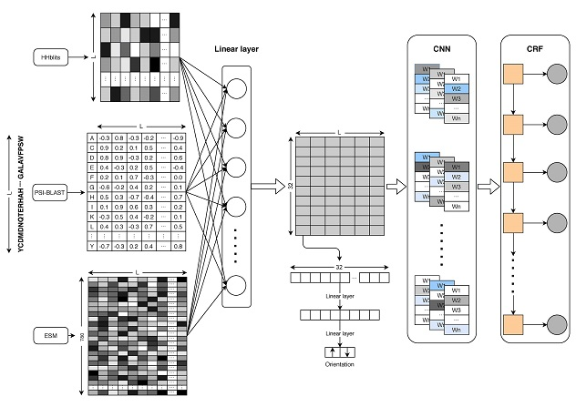

## Improving the topology prediction of alpha-helical transmembrane proteins with transfer learning
> *We will release the latest version of DeepTMpred, refactor the entire code, and provide a web server!*
### Abstract
Considering that the pre-trained language model can make full use of massive unlabeled protein 
sequences to obtain latent feature representation for TMPs
and reduce the dependence on evolutionary information, we proposed DeepTMpred, 
which used pre-trained self-supervised language models called ESM, convolutional neural networks, 
attentive neural network and conditional random fields for alpha-TMP topology prediction. 



### Dependencies

We used the following Python packages for core development. We tested on Python 3.7.

```
biopython
torch
scikit-learn
numpy
```

### Dataset
Orientations of Proteins in Membranes (OPM) database: https://opm.phar.umich.edu/download

### Pre-train model
We only provide the parameter files of the DeepTMpred-b.

```shell script
sh ./script/download.sh
```

### TMPs prediction script

```shell script
python tmh_main.py tmh_model_path orientation_model_path your_fasta_file &
```

### colab notebook [](https://colab.research.google.com/github/ISYSLAB-HUST/DeepTMpred/blob/master/notebook/test.ipynb)

   - Single Sequence Prediction
   - Long Sequence Prediction(length>1024)
   - Batch Sequence Prediction

### Result 

 - Baidu disk：https://pan.baidu.com/s/16UG9vD94_kSkn7D7dZ5zdQ 
 - Password：rq3x

### License
[MIT](LICENSE)

### Contact
If you have any questions, comments, or would like to report a bug, please file a Github issue or 
contact me at wanglei94@hust.edu.cn.
