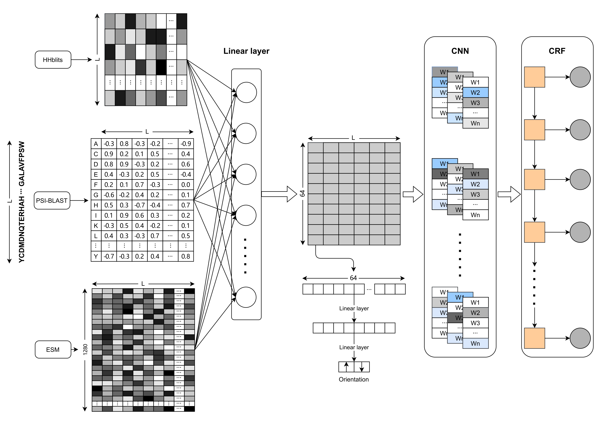

## Improving the topology prediction of alpha-helical transmembrane proteins with transfer learning

### Abstract
We consider that the pre-training language model can make most use of massive unlabeled protein sequence data to learn 
general feature representations for TMPs. Therefore, we proposed a transfer learning method, DeepTMpred, using pre-trained 
self-supervised language models called ESM, convolutional neural networks, and conditional random fields for alpha-TMP topology prediction. 
Compared with other tools, DeepTMpred can achieve state-of-the-art results and obtain pretty good prediction results for TMPs 
lacking sufficient evolutionary information.

{:height="50%" width="50%"}

### Dependencies

We used the following Python packages for core development. We tested on Python 3.7.

```
biopython
torch
scikit-learn
numpy
```

### Dataset
Orientations of Proteins in Membranes (OPM) database: https://opm.phar.umich.edu/download

### Pre-train model
We only provide the parameter files of the DeepTMpred(12).
All files can be downloaded from the following links: 
- [DeepTMpred-a](https://osf.io/2z6r9)
- [DeepTMpred-b](https://osf.io/2z6r9)


### TMH prediction
```shell script
python tmh_main.py &
```

### License
[MIT](LICENSE)

### Contact
If you have any questions, comments, or would like to report a bug, please file a Github issue or 
contact me at wanglei94@hust.edu.cn.